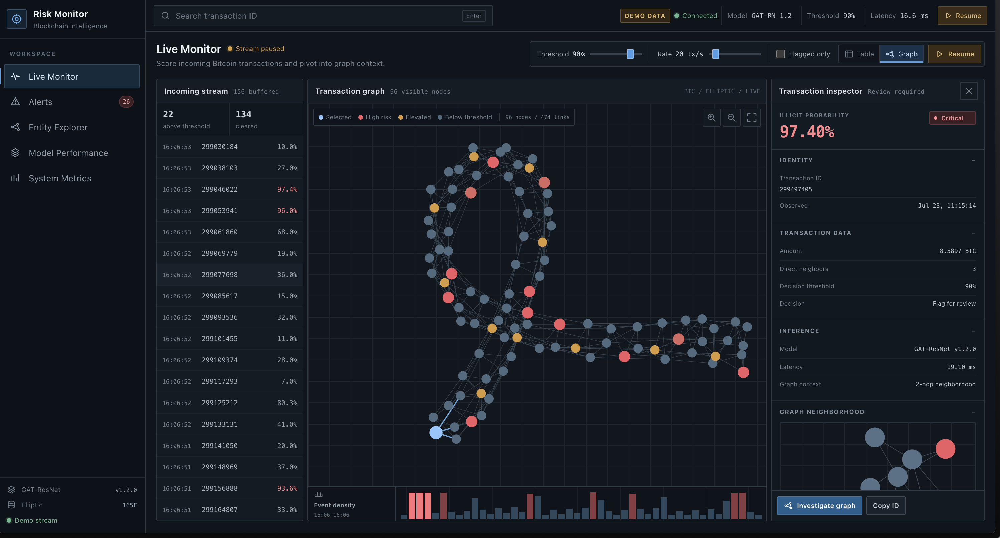

# Crypto Fraud Detection / Risk Monitor

A production-style, event-driven Bitcoin transaction risk-scoring system using
the committed GAT-ResNet model trained on the Elliptic dataset. Kafka carries
the real graph and scoring path, PostgreSQL owns durable graph/prediction state,
independently scalable workers run the unchanged model, Redis Streams provide
bounded WebSocket replay, and stateless FastAPI gateways serve the React
investigation console.



## Architecture

```text
Elliptic replay → Kafka graph batches → graph materializer → PostgreSQL + outbox
    → Kafka scoring requests → GNN worker group → Kafka scoring results
    → result projector → PostgreSQL + Redis Stream → FastAPI → React
```

Delivery is at least once. Stable event IDs, consumer inboxes, database
uniqueness, conditional upserts, deterministic results, and a transactional
outbox make redelivery harmless. The implementation does not claim exactly-once
delivery.

See [architecture.md](docs/architecture.md), the
[migration plan](docs/migration-plan.md), and the [ADRs](docs/adr/) for the
current/target flow, failure windows, topic contracts, backpressure, scaling,
security, and tradeoffs.

## Reproducible local environment

Requirements:

- Docker Engine with Compose
- At least 6 GB available memory for the full stack and model worker

Start Kafka (KRaft), PostgreSQL, Redis, migrations, topic bootstrap, all
application services, the frontend, Prometheus, Grafana, OpenTelemetry
Collector, and Tempo:

```bash
docker compose up --build
```

The default image contains a 12-node deterministic Elliptic-shaped fixture. It
exercises the real checkpoint, Kafka, database, model, Redis, API, and frontend
path; it is not presented as production data.

| Surface | URL |
|---|---|
| Analyst dashboard | http://localhost:3000 |
| FastAPI gateway | http://localhost:8000 |
| Prometheus | http://localhost:9090 |
| Grafana (`admin` / `admin`, local only) | http://localhost:3001 |
| Tempo API | http://localhost:3200 |

Verify that a canonical score reached PostgreSQL and Redis, REST can read it,
and a cursor-replay WebSocket publishes it:

```bash
docker compose run --rm -T test-runner \
  python scripts/verify_pipeline.py \
  --api-url http://gateway-lb:8080 \
  --websocket-url ws://gateway-lb:8080/api/v1/ws
```

Scale inference independently:

```bash
docker compose up -d --scale inference-worker=3
```

Remove the local containers and durable volumes:

```bash
docker compose down -v
```

### Full Elliptic dataset

Set `ELLIPTIC_DATA_DIR` to the directory containing
`elliptic_bitcoin_dataset/`, then include the read-only dataset override:

```bash
ELLIPTIC_DATA_DIR=/path/to/data \
docker compose \
  -f docker-compose.yml \
  -f infra/docker/compose.dataset.yml \
  up --build
```

The dataset directory must contain:

```text
elliptic_bitcoin_dataset/
  elliptic_txs_features.csv
  elliptic_txs_edgelist.csv
  elliptic_txs_classes.csv
```

Replay progress and speed are persisted. A browser never advances the source
iterator.

## Developer checks

Python 3.11 is required for direct host development:

```bash
python3.11 -m venv .venv
. .venv/bin/activate
pip install -r requirements.txt -r requirements-dev.txt

ruff format --check services shared scripts migrations tests
ruff check services shared scripts migrations tests
mypy services shared scripts --ignore-missing-imports
pytest tests/unit tests/contract tests/failure -q
```

Frontend:

```bash
cd frontend
npm ci
npm test -- --watchAll=false --passWithNoTests
npm run build
```

Distributed integration tests:

```bash
docker compose up --build -d --scale inference-worker=3
docker compose run --rm -T test-runner pytest tests/integration -q
```

Contract JSON Schemas are generated from Pydantic models:

```bash
python -m scripts.generate_schemas
```

Do not regenerate `shared/contracts/compatibility-baseline/` for a v1 change;
that immutable snapshot is the breaking-change guard.

## Failure and performance verification

`scripts/failure_probe.py` issues an accepted Kafka request that can be checked
after inference workers are killed and restarted. The distributed GitHub
Actions workflow automates this window and verifies the resulting canonical
score.

The benchmark reports real measurements or `null`, never target-shaped
estimates:

```bash
python scripts/benchmark.py \
  --worker-count 3 \
  --output benchmark.json
```

It separates PostgreSQL one-/two-hop query latency, Kafka queue delay, model
inference, result persistence, Redis publication, ingest-to-Redis, and live
Redis-to-WebSocket latency. The sub-270 ms claim is supported only by a run
whose recorded p95 meets the target; weighted F1 remains an offline model
quality metric, not an infrastructure latency metric.

## API

Backward-compatible paths remain available alongside `/api/v1`.

| Endpoint | Behavior |
|---|---|
| `GET /health/live` | Process liveness; independent of temporary dependencies |
| `GET /health/ready` | PostgreSQL and Redis serving readiness |
| `GET /health` | Backward-compatible aggregate health |
| `GET /entity/{tx_id}` | Durable transaction, score, and direct neighbors |
| `GET /subgraph/{tx_id}` | Bounded deterministic graph with `truncated` |
| `WS /ws` | Backward-compatible scored-event stream |
| `WS /api/v1/ws?last_event_id=...` | Live stream with bounded cursor replay |
| `GET /metrics` | Gateway Prometheus metrics |

WebSocket controls are strictly validated:

```json
{"type":"set_threshold","value":0.85}
{"type":"set_speed","interval":0.1}
{"type":"pause_replay"}
{"type":"resume_replay"}
```

Threshold changes are presentation-only and never rerun inference.

## Frontend demo mode

The isolated visual fixture remains opt-in when backend infrastructure is not
available:

```bash
cd frontend
REACT_APP_DEMO_MODE=true npm start
```

Use `REACT_APP_DEMO_STATE=disconnected` to inspect the explicit disconnected
state. Production behavior is the default.

## Model

The migration does not retrain or alter the model, scaler, preprocessing, or
checkpoint behavior.

- Architecture: three-layer GAT-ResNet with residual and input-skip connections
- Dataset: Elliptic Bitcoin Dataset, 49 temporal steps
- Split: train 1–34, validation 35–41, test 42–49
- Feature schema: `elliptic-165-v1`
- Stored versioning: model version, SHA-256 checksum, feature schema, graph
  watermark, and deployment-selected presentation threshold

Committed offline evaluation at threshold 0.90:

| Metric | Value |
|---|---:|
| AUC-PR (illicit) | 0.874 |
| MCC | 0.609 |
| Illicit precision | 68% |
| Illicit recall | 60% |
| Illicit F1 | 0.639 |
| Weighted F1 | 0.942 |
