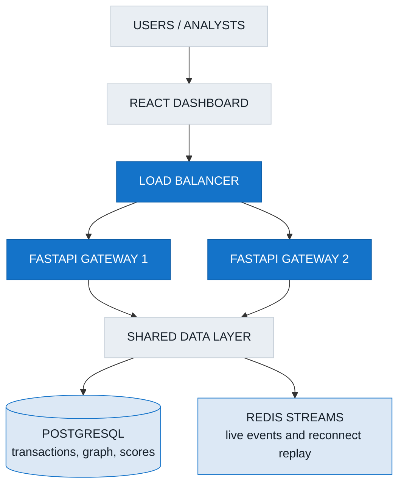
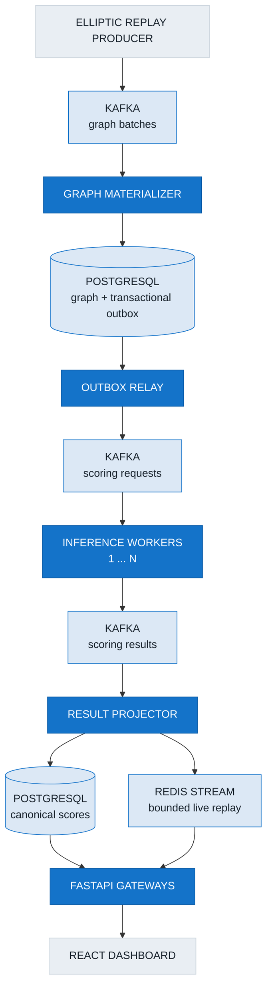

# Risk Monitor architecture

Risk Monitor scores blockchain transactions with the committed GAT-ResNet
model and streams the results to a React investigation console.

The system is intentionally small:

- Kafka buffers accepted work.
- PostgreSQL stores the graph, scores, checkpoints, inboxes, and outboxes.
- Redis Streams provides short-lived WebSocket replay.
- FastAPI serves stored data without loading the model.
- Inference workers scale independently from the API.

## System overview

### Analyst serving path



The load balancer may send any REST request or WebSocket connection to any
gateway. Gateways are stateless: PostgreSQL is the source of truth, and Redis
holds only bounded real-time history.

### Transaction scoring path



Kafka is part of the real processing path. A browser does not advance the
dataset and a FastAPI process does not run inference.

## What changed

| Before | Now |
|---|---|
| A WebSocket connection advanced the dataset | A dedicated producer replays and checkpoints it |
| FastAPI held the graph and scores in memory | PostgreSQL owns graph and prediction state |
| FastAPI loaded the model and ran inference | Kafka workers load and run the model |
| One process served its own WebSocket events | Redis Streams lets any gateway serve or replay events |
| A restart erased process-local state | Kafka and PostgreSQL recover accepted work |

## How one transaction moves through the system

1. The replay producer publishes an ordered graph batch to Kafka.
2. The graph materializer commits nodes, edges, its inbox record, the graph
   watermark, and scoring outbox rows in one PostgreSQL transaction.
3. The outbox relay publishes the scoring requests to Kafka.
4. One inference worker reads each request, loads the bounded two-hop graph
   from PostgreSQL, and runs the unchanged model.
5. The worker publishes the probability to the scoring-results topic.
6. The result projector stores one canonical score per transaction and model
   version, then publishes a real-time event to Redis Streams.
7. Any FastAPI gateway can replay the event from a Redis cursor and send it to
   the dashboard.

The dashboard applies its selected fraud threshold to the stored probability.
Changing the threshold does not rerun the model.

## Service responsibilities

| Component | Responsibility | Scales horizontally? |
|---|---|---:|
| Replay producer | Reads temporal data, honors the persisted replay rate, and checkpoints progress | No; one ordered producer |
| Graph materializer | Stores graph batches and creates scoring intents atomically | Failover replica only |
| Outbox relay | Publishes committed scoring intents with safe row locking | Yes |
| Inference worker | Loads one model instance and scores bounded two-hop subgraphs | Yes |
| Result projector | Stores canonical scores and creates Redis events idempotently | Yes, by Kafka partition |
| FastAPI gateway | Serves REST and WebSockets from PostgreSQL and Redis | Yes |
| React dashboard | Presents the bounded stream progressively and supports investigation | Client-side |

## Kafka topics

| Topic | Producer | Consumer group | Key | Partitions |
|---|---|---|---|---:|
| `risk.graph-batches.v1` | Replay producer | `risk-graph-materializer-v1` | Stream name | 1 |
| `risk.scoring-requests.v1` | Outbox relay | `risk-inference-workers-v1` | Transaction ID | 6 |
| `risk.scoring-results.v1` | Inference workers | `risk-result-projector-v1` | Transaction ID | 6 |
| `risk.scoring-dlq.v1` | Durable consumers | Operator tooling | Original key | 3 |

The graph topic has one partition because graph timesteps must be materialized
in order. Scoring requests and results are partitioned because transactions can
be scored independently.

Every event has a versioned envelope containing:

- event, trace, correlation, and causation IDs;
- event type and schema version;
- event time and production time;
- producer identity and versioned payload.

The schema version is present in both the body and Kafka headers. Pydantic
models, committed JSON Schemas, and contract tests protect compatibility.

## Durable state

| Table | Stores | Main correctness rule |
|---|---|---|
| `transactions` | Transaction features, timestep, and graph watermark | One row per transaction |
| `transaction_edges` | Original directed Elliptic edges | Unique source/destination pair |
| `risk_scores` | Probability and latency metadata | One row per transaction and model version |
| `consumer_inbox` | Events already applied by a consumer | Unique event and consumer pair |
| `outbox_events` | Events that must be published after a database commit | Stable outbox ID |
| `stream_checkpoints` | Producer and materializer progress | One checkpoint per stream |
| `replay_control` | Running, paused, or completed state and replay rate | One row per stream |

Transaction features use JSONB because the model consumes the complete
165-value vector and the API does not query individual feature dimensions.
PostgreSQL edge indexes support bounded incoming and outgoing neighbor queries;
a graph database is not required for the current access pattern.

Redis is not the source of truth. It stores a bounded event window for live
delivery and reconnect replay. If Redis history is lost, PostgreSQL still holds
the graph and scores.

## Delivery and idempotency

The system provides **at-least-once delivery with idempotent processing**. It
does not claim end-to-end exactly-once delivery.

- Kafka producers use stable keys, deterministic event IDs, `acks=all`, and
  idempotent producer settings.
- Consumers commit Kafka offsets only after their durable work succeeds.
- Consumer inbox rows make a redelivered event harmless.
- Database primary keys and upserts prevent duplicate nodes, edges, and scores.
- The transactional outbox prevents committed graph state from losing its
  scoring request.
- If an outbox event is published twice, downstream deterministic IDs and
  uniqueness constraints preserve one canonical result.
- Redis publication uses a durable PostgreSQL intent and event-ID
  deduplication.

## Backpressure

Kafka absorbs bursts. Memory does not grow with Kafka lag.

- Consumers poll bounded batches.
- Workers use bounded queues and pause Kafka partitions when full.
- Database pools, query timeouts, retries, and inference timeouts are bounded.
- Redis retains a bounded stream.
- Each WebSocket client has a bounded send queue; persistently slow clients are
  disconnected with a retryable status.
- The React client retains up to 10,000 transactions and graph nodes, covering
  the complete 9,600-transaction bundled replay.

When input exceeds inference capacity, Kafka lag rises and becomes visible in
metrics. Accepted events remain durable and workers catch up after capacity is
added or input slows.

## Failure behavior

| Event | What happens |
|---|---|
| An inference worker dies | Kafka keeps uncommitted requests and reassigns its partitions |
| The graph materializer dies | Its ordered partition moves to the standby and an uncommitted event is redelivered |
| PostgreSQL commits but offset commit fails | The inbox row causes the redelivered event to be skipped safely |
| The outbox relay publishes twice | Stable IDs and unique score keys make the duplicate harmless |
| Kafka is temporarily unavailable | Producers and consumers retry with bounded exponential backoff |
| PostgreSQL is temporarily unavailable | Processing pauses and Kafka retains accepted work |
| Redis is temporarily unavailable | Canonical scores remain in PostgreSQL and Redis publication is retried |
| A gateway restarts | Clients reconnect to any replica and resume from a recent Redis cursor |
| A browser is too slow | Its bounded queue fills and the gateway disconnects it |
| An event is permanently invalid | It reaches the DLQ with its source coordinates and sanitized failure details |

DLQ replay is explicit: an operator selects a partition and offset, creates a
new event ID, preserves the original ID as causation, and records the replay
initiator.

## Observability

Every service emits structured JSON logs, Prometheus metrics, and OpenTelemetry
traces. Trace context follows the transaction through Kafka, PostgreSQL outbox
payloads, workers, Redis, and WebSocket delivery.

The supplied Grafana dashboard covers:

- throughput and Kafka consumer lag;
- p50, p95, and p99 inference and end-to-end latency;
- retry, error, and DLQ rates;
- outbox backlog;
- active workers and WebSocket clients;
- PostgreSQL and Redis health.

See [verification.md](verification.md) for measured local results. The latest
recorded p95 applies only to its stated hardware, worker count, and replay rate;
it is not a production SLA.

## Scaling and deployment

Local Compose runs one Kafka broker, one PostgreSQL server, one Redis server,
two API gateways, and a configurable inference-worker count:

```bash
docker compose up --build --scale inference-worker=3
```

The model is loaded once per worker process. Adding workers increases scoring
capacity without adding model work to the API.

The Kubernetes examples deploy only the application workloads. Production
Kafka, PostgreSQL, and Redis should be managed, highly available services.
Gateway replicas can scale on CPU or connection load. Worker replicas should
eventually scale on Kafka consumer lag; CPU is only the portable example
signal.

## Boundaries and known limits

- The local graph-batch topic is deliberately single-partitioned.
- Scoring parallelism is capped by the six request partitions until a
  controlled topic-version migration increases that count.
- PostgreSQL two-hop queries are bounded by hop, node, edge, and timeout limits.
- The browser renders the full 9,600-node bundled fixture, but larger external
  datasets need server-side graph windows or level-of-detail rendering.
- The committed model is not retrained or altered by this architecture.
- Local Kafka, PostgreSQL, and Redis containers are reproducible development
  dependencies, not production high-availability deployments.

## Security boundary

Implemented basics include input validation, message-size limits, a
configurable CORS allowlist, sanitized errors, dependency timeouts, non-root
application containers, and environment-based secrets.

A production deployment still needs authentication, authorization, TLS, Kafka
ACLs, database least privilege, Redis authentication, network policies, managed
secret rotation, and immutable analyst audit logs.

## Architecture decisions

Detailed rationale is recorded in [the ADR directory](adr/):

- Kafka is the durable event backbone.
- PostgreSQL is used instead of a graph database.
- Delivery is at least once with idempotent effects.
- Graph materialization is ordered.
- Inference scales independently.
- Redis Streams provides bounded WebSocket fan-out and reconnect replay.
- FastAPI gateways do not load the model.
- A transactional outbox connects database commits to Kafka publication.
