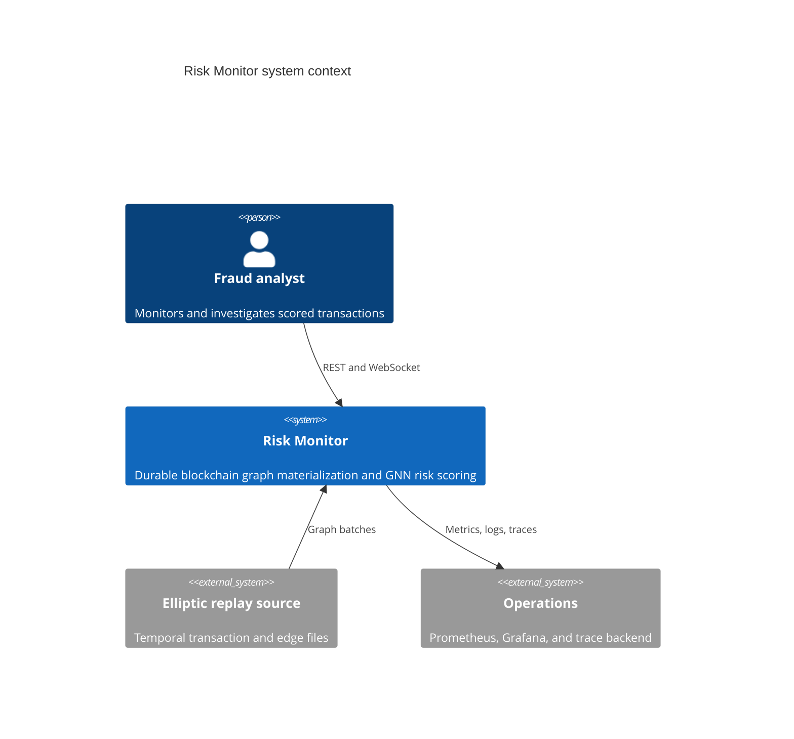
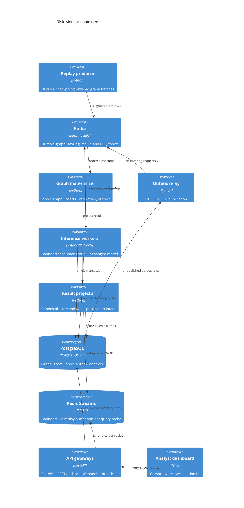
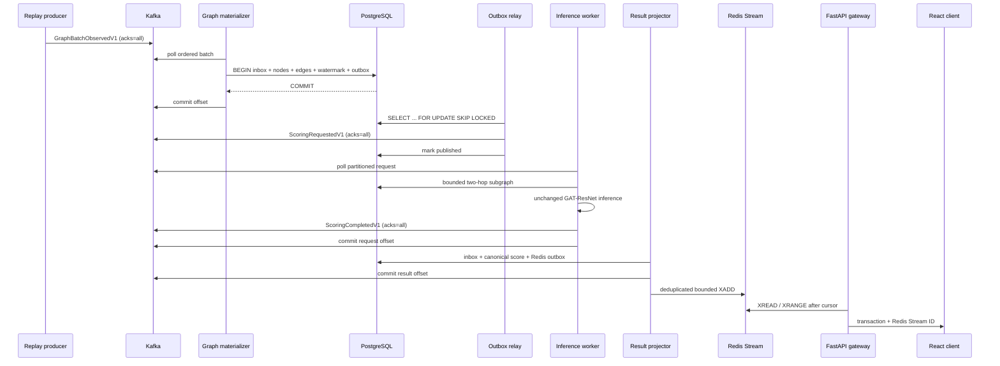

# Risk Monitor architecture

## Requirements

Functional requirements are temporal Elliptic replay, unchanged two-hop
GAT-ResNet scoring, threshold-independent probability storage, live analyst
delivery, entity lookup, bounded graph exploration, replay controls, and
multiple model versions.

Non-functional requirements are durable accepted work, at-least-once delivery,
idempotent effects, bounded memory, independent inference scaling, stateless
gateways, restart/rebalance recovery, versioned contracts, observable
saturation, and reproducible local deployment.

## Capacity assumptions

The initial graph stream is one ordered partition because a timestep must be
committed before its scoring requests exist. Scoring requests and results use
six partitions, allowing up to six active partition owners without increasing
the topic count. Default worker capacity is eight bounded local records per
process and one inference at a time per process. Redis retains approximately
10,000 scored events locally and each gateway permits 2,000 clients with a
256-event queue per client. These are explicit starting values, not measured
production limits.

## Current architecture discovered

Before this migration, FastAPI startup loaded CSV files, the scaler, and the
PyTorch checkpoint. A WebSocket connection advanced the replay iterator,
mutated an in-memory undirected `GraphBuffer`, built a two-hop subgraph, ran the
GNN, stored the score in a local dictionary, and sent it to that client.
`/entity` and `/subgraph` read those process-local objects. There was no durable
checkpoint, consumer offset, shared fan-out, or API replica consistency.

## Target architecture implemented

## End-to-end sequence

## Kafka topics

| Topic | Producer | Consumer/group | Key | Partitions | Local retention | Ordering / expected local rate |
|---|---|---|---|---:|---:|---|
| `risk.graph-batches.v1` | replay producer | graph materializer / `risk-graph-materializer-v1` | stream name | 1 | 7 days | Strict timestep order; default 10 batches/s in Compose |
| `risk.scoring-requests.v1` | outbox relay | workers / `risk-inference-workers-v1` | transaction ID | 6 | 7 days | Per-key order only; roughly nodes per graph batch |
| `risk.scoring-results.v1` | inference workers | projector / `risk-result-projector-v1` | transaction ID | 6 | 7 days | Per-key order only; follows scoring capacity |
| `risk.scoring-dlq.v1` | consumers/workers | operator tooling | original key | 3 | 30 days | No processing-order guarantee |

Schema version appears in the event body and Kafka headers. Committed JSON
Schemas are generated from strict Pydantic v1 models. Contract tests compare
the current schema to an immutable compatibility baseline.

## Consumer groups

| Group | Replicas | Scaling rule |
|---|---:|---|
| `risk-graph-materializer-v1` | 2 in Kubernetes example | One active partition owner; replicas provide failover |
| `risk-inference-workers-v1` | 1 local, independently scalable | Add workers until partitions or downstream capacity are saturated |
| `risk-result-projector-v1` | 2 in Kubernetes example | Partition-parallel idempotent projection |

## Data ownership and PostgreSQL schema

| State | Owner | Correctness mechanism |
|---|---|---|
| Transaction features and watermark | graph materializer | `transactions.tx_id` PK and conditional upsert |
| Directed source edges | graph materializer | composite edge PK plus source/destination indexes |
| Canonical prediction | result projector | `(tx_id, model_version)` PK and monotonic watermark/time update |
| Consumer completion | each durable consumer | `(event_id, consumer_name)` inbox PK |
| Pending publication | writing transaction | stable outbox ID, row lock, acknowledgement before mark |
| Replay progress/control | replay producer/API control | stream-name PK and transactional checkpoint |

`transactions.features` uses JSONB. The model consumes the full 165-value
vector and the gateway does not filter on individual dimensions, so JSONB
avoids 165 schema columns and preserves an atomic feature-schema version. The
tradeoff is conversion cost and no per-feature index; normalized columns would
be justified only if online feature predicates became a requirement.

`transaction_edges` stores the original directed Elliptic edge once. Bounded
neighborhood discovery treats connectivity as undirected, matching the old
`GraphBuffer`, and the worker reconstructs both edge directions immediately
before calling the unchanged GNN.

## Delivery and idempotency

The system is end-to-end **at least once**, not exactly once.

- Producers use Kafka idempotence, stable keys, `acks=all`, and deterministic
  IDs for replay batches, scoring intents, and scoring results.
- Consumers disable automatic commits. Graph/result offsets move only after
  the database transaction commits; worker offsets move only after Kafka
  acknowledges the result or DLQ record.
- Inbox primary keys make post-commit/pre-offset-crash redelivery harmless.
- Node, edge, score, and outbox uniqueness constraints enforce canonical state.
- The transactional outbox prevents graph state from committing without its
  scoring intent.
- If a relay publishes and dies before marking the row, it republishes the same
  logical event. The worker produces the same deterministic result ID and the
  projector inbox/score key makes the duplicate harmless.
- Redis publication has a durable PostgreSQL intent and a Lua `event_id` dedup
  key around bounded `XADD`.

## Ordering and partitioning

Graph batches require global timestep order and therefore use one partition.
Scoring work does not require global order; request and result topics are keyed
by transaction ID and partitioned. Events carry source timestep, event
sequence, graph watermark, event time, produced time, correlation, causation,
and trace metadata so stale or out-of-order work is visible. A canonical score
updates only when its watermark and scoring time are not older.

## Durable graph queries

Entity lookup and one-/two-hop exploration read PostgreSQL. Each breadth level
uses both edge indexes, stable lexical ordering, a statement timeout, node and
edge limits, duplicate removal, and an explicit `truncated` result. Cache keys
include transaction ID, hop count, both limits, graph watermark, and model
version. Redis cache TTL is short and cache loss never affects correctness.

## Backpressure and overload

Kafka is the durable backlog. Consumers poll bounded batches. Each worker owns
a bounded queue; it pauses assigned partitions when full and resumes below half
capacity. Database pools, query timeouts, inference timeouts, retry counts,
outbox batches, Redis Stream length, per-client queues, message size, send
timeouts, and client counts are bounded. A full WebSocket queue disconnects the
slow client with a retryable close code instead of consuming unbounded memory.

When input exceeds inference capacity, request-topic lag rises while process
memory remains bounded. Accepted Kafka records remain durable, saturation is
visible in lag/queue metrics, and workers catch up when capacity returns.

## Failure classification and recovery

Invalid contracts and poison/model failures are permanent and reach the DLQ
with the original topic, partition, offset, key, payload, event ID, stage,
exception class, sanitized error, attempts, timestamps, and trace ID. Database,
Kafka, and Redis availability errors are transient and use bounded exponential
backoff with jitter. DLQ replay requires an explicit partition and offset,
creates a new event ID, records the old ID as causation, and requires an
initiator.

### What happens when...

- **An inference worker dies:** Kafka retains uncommitted requests; the group
  reassigns partitions and another worker retries them.
- **The active graph materializer dies:** its single partition moves to the
  standby. An uncommitted event is redelivered; the inbox removes duplicate
  effects.
- **Kafka redelivers an event:** deterministic IDs, inbox keys, uniqueness
  constraints, and upserts make processing harmless.
- **PostgreSQL commits but offset commit fails:** redelivery finds the inbox row
  written in that same transaction and skips durable mutation.
- **The outbox relay publishes twice:** the request ID and result ID are stable;
  downstream canonical state remains one row.
- **Redis loses ephemeral history:** canonical graph and scores remain in
  PostgreSQL. Old cursor replay may be unavailable, but REST state survives.
- **A FastAPI gateway restarts:** no canonical state is local. The new replica
  queries PostgreSQL and resumes Redis after the client cursor.
- **A browser reconnects:** it sends `last_event_id`; the gateway returns a
  bounded `XRANGE` replay and then live events.
- **Input exceeds inference capacity:** Kafka lag grows, queues stay bounded,
  and recovery occurs by draining lag or adding workers.
- **A new model version is deployed:** new workers publish a distinct version
  and scores coexist under the composite key. Shadow a bounded sample, compare
  score/latency distributions, promote, and retain the previous version for
  rollback.
- **The event schema changes:** compatible additions remain v1; required-field,
  type, or semantic changes require a new schema and topic version.
- **The feature schema changes:** use a new feature-schema version and matching
  worker deployment. A worker does not silently score an incompatible vector.

## Observability

JSON logs bind service and environment and add event, transaction, model,
topic, partition, offset, attempt, duration, outcome, trace, and correlation
fields where relevant. Prometheus scrapes replay, materialization, outbox,
worker, projection, lag, Redis, REST, cache, and WebSocket metrics. The
provisioned Grafana dashboard shows throughput, consumer lag, p50/p95/p99
inference and ingest-to-result latency, error/retry/DLQ rates, outbox backlog,
worker count, and client count. W3C trace context and the stable trace ID cross
Kafka, the outbox payload, workers, projection, Redis, and WebSocket fan-out.

## Scaling and deployment

Compose uses one-node Kafka/PostgreSQL/Redis strictly for reproducible local
development. `docker compose up --scale inference-worker=3` puts three model
processes in one consumer group without changing API behavior. Gateways are
stateless and can be replicated behind any WebSocket-capable load balancer
without sticky sessions.

Kubernetes examples cover application Deployments, probes, rolling updates,
resources, graceful termination, disruption budgets, and CPU HPAs. Production
Kafka, PostgreSQL, and Redis are managed HA dependencies. CPU is a portable
initial worker HPA signal; Kafka request lag is the preferred production signal.

## Security

Implemented basics include strict event/control validation, transaction-ID
length and character validation, numeric bounds, a configurable CORS allowlist,
maximum WebSocket message size, timeouts, non-root application containers,
environment secrets, sanitized errors, and no raw tensors/features in client
events.

A real deployment still requires user authentication, role/transaction
authorization, TLS termination, Kafka ACLs and TLS/SASL, database least
privilege, Redis authentication/TLS, network policies, managed secret rotation,
image signing, and immutable analyst audit logging.

## Cost, bottlenecks, and evolution

The design deliberately pays for three durable shared systems and six small
Python service roles, avoiding a graph database, stream processor, service mesh,
and ML platform. The model image and per-worker memory dominate compute cost.
Known bottlenecks are the single ordered graph partition, JSONB vector decode,
CPU GNN inference, PostgreSQL neighborhood expansion on high-degree nodes, and
six scoring partitions. Graph-safe micro-batching is intentionally disabled
(`batch_size=1`, `batch_wait=0`) because the existing model consumes
independently shaped subgraphs. Scale workers first; implement and measure a
semantics-preserving batch adapter before enabling batch/wait tuning. Raise
partitions during a controlled topic-version migration, and consider
feature-column or graph-storage changes only after query evidence.

The benchmark records actual values or `null`; it never substitutes targets.
The résumé latency statement is defensible only for a recorded run whose
reported p95 ingest-to-Redis result is below 270 ms and whose live
Redis-to-WebSocket sample is also stated.
